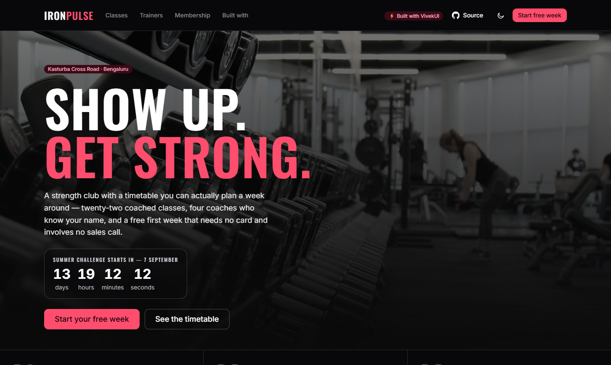
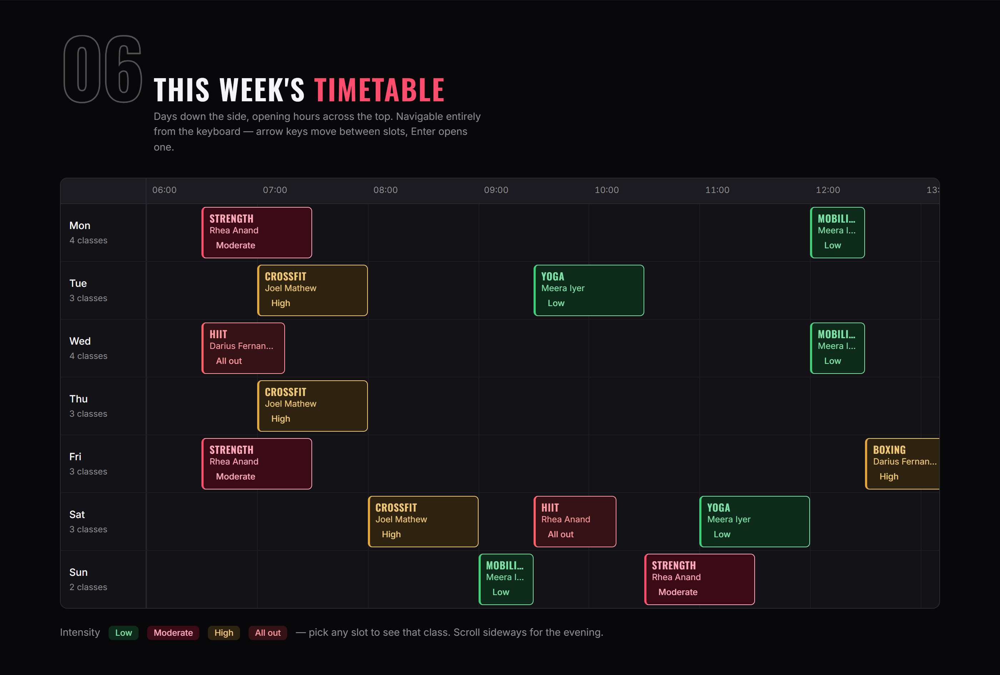
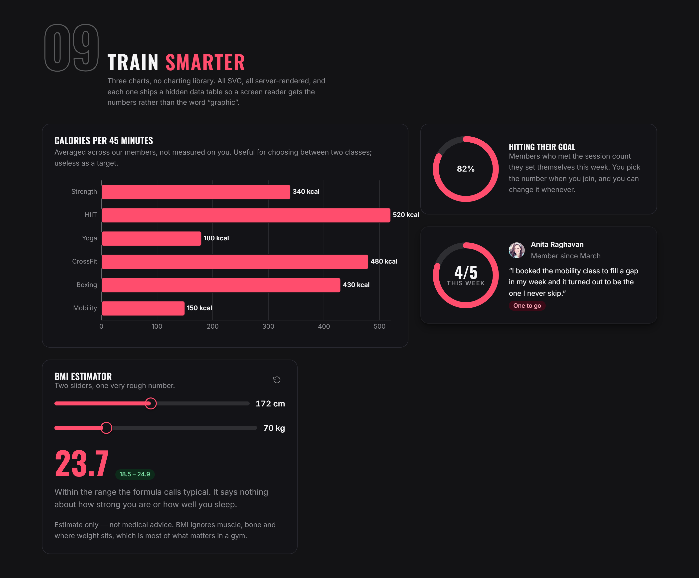

<div align="center">

# IronPulse

### A free, open-source gym &amp; fitness website template for Next.js

Built entirely with **[VivekUI](https://ui.vivekkumarsingh.in/docs?utm_source=vivekui-template&utm_campaign=fitness&utm_medium=readme)** — 91 React components, 6 SVG charts, zero runtime dependencies.

[](https://ironpulse.vivekkumarsingh.in)
[](https://github.com/intellectwithvivek/ironpulse/generate)

[](https://ui.vivekkumarsingh.in/docs?utm_source=vivekui-template&utm_campaign=fitness&utm_medium=readme)
[](https://www.npmjs.com/package/@the_viveksingh/vivek-ui)
[](https://nextjs.org)
[](https://react.dev)
[](https://www.typescriptlang.org)
[](https://www.npmjs.com/package/@the_viveksingh/vivek-ui)
[](#accessibility)
[](LICENSE)

</div>

<br>



<br>

A production-quality gym and fitness studio site: a real weekly class timetable,
membership plans, coach profiles, a BMI estimator and three SVG charts. Dark,
high-energy art direction with a rose accent.

**No Tailwind. No shadcn/ui. No MUI. No charting library. No date library.**
Every piece of UI on the site comes from a single package with zero runtime
dependencies — which is the point of the whole thing.

<p align="center">
  
  
</p>

---

## Table of contents

- [Quick start](#quick-start)
- [Deploy](#deploy)
- [What is in it](#what-is-in-it)
- [Project structure](#project-structure)
- [Making it yours](#making-it-yours)
- [Notes on the build](#notes-on-the-build)
- [Accessibility](#accessibility)
- [SEO and AEO](#seo-and-aeo)
- [Built with VivekUI](#built-with-vivekui)
- [Contributing](#contributing)
- [Licence](#licence)

---

## Quick start

Requires **Node.js 20.9+** (22 LTS recommended).

```bash
git clone https://github.com/intellectwithvivek/ironpulse.git
cd ironpulse
npm install
npm run dev
```

Open <http://localhost:3000>.

| Script | What it does |
|---|---|
| `npm run dev` | Development server (Turbopack) |
| `npm run build` | Production build |
| `npm run start` | Serve the production build |
| `npm run lint` | ESLint |

Prefer to start from a clean history? Use
**[Use this template](https://github.com/intellectwithvivek/ironpulse/generate)**
on GitHub instead of cloning.

## Deploy

[](https://vercel.com/new/clone?repository-url=https%3A%2F%2Fgithub.com%2Fintellectwithvivek%2Fironpulse&project-name=ironpulse&repository-name=ironpulse)

No environment variables, no database, no API keys. It builds and deploys as-is.

**One thing to change after deploying:** set `SITE.url` in
[`data/site.ts`](data/site.ts) to your own domain. `metadataBase`, every
canonical URL, the sitemap, `robots.txt`, the Open Graph image and every JSON-LD
`@id` are all derived from that single value.

```ts
// data/site.ts
export const SITE = {
  url: 'https://your-domain.com',   // ← the only URL you need to change
  ...
}
```

## What is in it

| Route | What it holds |
|---|---|
| `/` | Hero with a live countdown, headline counters, occupancy sparkline, six programmes, **the weekly timetable**, coach grid, results carousel, three charts, BMI estimator, pricing, testimonials, FAQ |
| `/classes` | All six programmes as cards, filterable by programme and intensity, deep-linkable via `?type=hiit` |
| `/trainers` | Four coach profiles with specialities and contact links |
| `/join` | Three-step sign-up: plan → details → confirmation with a first-week timeline |
| `/built-with` | Every component on the site, mapped section by section and deep-linked to its docs |

Generated automatically: `/sitemap.xml`, `/robots.txt`, `/manifest.webmanifest`,
`/opengraph-image`, `/icon`, and `/llms.txt` for answer engines.

## Project structure

```
app/
  layout.tsx            root layout: fonts, theme, toasts, site-wide JSON-LD
  page.tsx              homepage
  classes/  trainers/  join/  built-with/
  sitemap.ts  robots.ts  manifest.ts
  opengraph-image.tsx   social card, generated at build time
  icon.tsx              favicon, generated at build time
  globals.css           the entire design layer (VivekUI token overrides)
components/             composed sections — no UI primitives of its own
data/                   all content, as typed modules
lib/
  schedule.ts           the recurring-week → Scheduler projection
  theme-script.ts       server-safe anti-flash theme script
  use-media-query.ts    for props that must change at a breakpoint
```

## Making it yours

All content is mock data in typed modules. There is no CMS and no database to
stand up:

| File | What it drives |
|---|---|
| [`data/site.ts`](data/site.ts) | Site URL, repo links, address, phone, opening hours, UTM builder |
| [`data/classes.ts`](data/classes.ts) | The six programmes and every session on the timetable |
| [`data/trainers.ts`](data/trainers.ts) | Coach profiles |
| [`data/plans.ts`](data/plans.ts) | Membership tiers and pricing |
| [`data/gym.ts`](data/gym.ts) | Headline figures, occupancy, results, testimonials, FAQ |

Change one session in `data/classes.ts` and the timetable, the class list, the
"22 classes a week" counter and the JSON-LD all follow. Nothing is duplicated.

### Rebranding

Every colour, radius and type step is a CSS custom property. The whole rose
accent is two blocks at the top of [`app/globals.css`](app/globals.css):

```css
:root {
  --vk-color-primary: #d81e46;
  --vk-color-ring: #d81e46;
  --vk-chart-1: #d81e46;
}
:root[data-theme='dark'] {
  --vk-color-primary: #ff4d6d;
  --vk-chart-1: #ff4d6d;
}
```

Library selectors are all wrapped in `:where()`, so they carry specificity zero
and a single flat class of your own beats them. There is no `!important`
anywhere in this repo.

### Removing the credit

The footer credit and the navbar badge are a thank-you, not a licence condition.
Delete the `.ip-credit` block in
[`components/site-footer.tsx`](components/site-footer.tsx) and the
`.ip-nav-badge` anchor in
[`components/site-navbar.tsx`](components/site-navbar.tsx) and you are done. A
⭐ on the repo is appreciated instead.

## Notes on the build

A few decisions worth knowing before you edit.

- **The timetable is a recurring week, not real dates.** `Scheduler`'s x-axis is
  absolute time, so a literal Mon–Sun of real dates would stretch it across
  seven days. Every session is projected onto one fixed anchor day with the
  *day* as the resource — that is what turns a timeline into a grid. All
  timestamps are built from `Date.UTC` and read back with a UTC formatter, so
  the axis is byte-identical on the server and in a browser anywhere on earth.
  See [`lib/schedule.ts`](lib/schedule.ts).
- **Clock reads happen on the server and are passed down.** `Countdown`, `Clock`
  and the occupancy reading all take a `now` prop for exactly this reason —
  without it they render a placeholder rather than risk a hydration mismatch.
  The homepage sets `revalidate = 3600` so those values stay fresh.
- **The Summer Challenge date is derived, not hard-coded** — the first Monday of
  next month — so the countdown never expires into a template reading "0 days".
- **Server components by default.** Only genuinely interactive pieces carry
  `'use client'`: the timetable, the BMI sliders, the pricing switch, the class
  filters, the sign-up flow and the navbar.
- **`themeScript` is re-declared** in
  [`lib/theme-script.ts`](lib/theme-script.ts) rather than imported. The
  library's copy lives in a `'use client'` module, and under React Server
  Components every export of a client module reaches the server as a client
  *reference* — importing it into `app/layout.tsx` would serialise a proxy into
  the `<script>` instead of the code.
- **Three narrow-viewport containments live in `globals.css`**, each commented
  with the reason: the charts' visually-hidden data table, long inline code
  tokens, and the clone command. All three would otherwise widen the page below
  390px.

## Accessibility

Verified with `axe-core` across all five routes in **both themes** and **both
motion preferences** — 20 combinations, **zero WCAG 2.1 A/AA violations** — plus:

- One `<h1>` per page, and a correct heading outline throughout
- A skip link as the first tab stop, and a focus ring that survives being drawn
  over a photograph
- The timetable is fully keyboard-navigable — arrow keys move between slots and
  across days, Enter opens one
- Every chart ships a visually hidden `<table>` of its real numbers, so a screen
  reader gets the data rather than the word "graphic"
- Intensity is never conveyed by colour alone; every slot carries the word too
- `prefers-reduced-motion` is respected by the counters, carousel and marquee
- No tap target under 24×24 CSS px except inline text links, which WCAG 2.5.8
  exempts
- **No horizontal overflow at any width from 320px to 1920px**; wide content
  scrolls inside its own container

## SEO and AEO

- Metadata API per route, with `metadataBase`, canonicals, Open Graph and Twitter
- [`app/sitemap.ts`](app/sitemap.ts), [`app/robots.ts`](app/robots.ts) and
  [`app/manifest.ts`](app/manifest.ts)
- A generated Open Graph card ([`app/opengraph-image.tsx`](app/opengraph-image.tsx))
  and favicon ([`app/icon.tsx`](app/icon.tsx)) — no binary assets to keep in sync
- JSON-LD: `WebSite` + `Person` site-wide, `ExerciseGym`/`HealthClub` with
  opening hours and address, an `Offer` per plan, `FAQPage`, `BreadcrumbList`,
  an `ItemList` of classes, and `SoftwareSourceCode` for the template itself
- [`public/llms.txt`](public/llms.txt) so answer engines can summarise the site
  accurately — including the note that the gym is fictional

## Built with VivekUI

**44 distinct components**, one install, one CSS import:

```bash
npm i @the_viveksingh/vivek-ui
```

```tsx
// app/layout.tsx
import '@the_viveksingh/vivek-ui/styles.css'
import '@the_viveksingh/vivek-ui/charts.css'   // separate, so no-chart apps pay nothing
```

The resource **Scheduler** behind the timetable, all three charts
(**BarChart**, **ProgressRing**, **Sparkline**) and the **Countdown** in the
hero all ship in that same package. That combination normally means a calendar
library, a charting library and a date library, each with its own dependency
tree. shadcn/ui, Mantine and Radix ship no scheduler at all; MUI's sits behind a
paid licence.

| | |
|---|---|
| **Docs** | <https://ui.vivekkumarsingh.in/docs> |
| **npm** | <https://www.npmjs.com/package/@the_viveksingh/vivek-ui> |
| **Library source** | <https://github.com/intellectwithvivek/vivek_UI> |
| **Author** | [Vivek Kumar Singh](https://vivekkumarsingh.in/?utm_source=vivekui-template&utm_campaign=fitness&utm_medium=readme) |

See **[/built-with](https://ironpulse.vivekkumarsingh.in/built-with)** on the
live demo for the full section-by-section map, every component deep-linked to
its own documentation page.

<details>
<summary><strong>Every VivekUI component used (44)</strong></summary>

<br>

**Layout &amp; typography** (6) — Container, Section, Stack, Heading, Text, Card

**Actions** (3) — Button, IconButton, CopyButton

**Forms** (6) — Field, Input, Select, Slider, Switch, RadioGroup

**Navigation** (3) — Navbar, Breadcrumb, Stepper

**Data display** (8) — Scheduler, Table, Badge, Code, Avatar, Progress,
Timeline, EmptyState

**Charts** (3) — BarChart, ProgressRing, Sparkline

**Page sections** (6) — Hero, FeatureGrid, Pricing, Testimonials, FAQ, Footer

**Media &amp; time** (5) — Carousel, MapEmbed, Clock, Countdown, AnimatedCounter

**Feedback** (2) — Alert, Toast (`ToastProvider` + `useToast`)

**Theming** (2) — ThemeProvider, ThemeToggle

This list is not hand-maintained. `/built-with` builds the same 44 from a single
table in [`app/built-with/page.tsx`](app/built-with/page.tsx), so the count on
the page and the components actually imported cannot drift apart.

</details>

## Contributing

Issues and pull requests are welcome — this is a showcase, so improvements to
the design, the accessibility or the docs all count.

```bash
npm install
npm run dev
npm run lint && npm run build   # both must be clean before a PR
```

Found a bug? [Open an issue](https://github.com/intellectwithvivek/ironpulse/issues).

## Licence

[MIT](LICENSE). Use it commercially, rebrand it, strip the credit — all fine.

**IronPulse is a fictional gym.** The address, phone number, email, coaches,
members and occupancy figures are mock data for a website template and do not
describe a real business. Photographs come from
[Unsplash](https://unsplash.com), [Picsum](https://picsum.photos) and
[Pravatar](https://i.pravatar.cc).

---

<div align="center">

Built with ❤️ using **[VivekUI](https://ui.vivekkumarsingh.in/docs?utm_source=vivekui-template&utm_campaign=fitness&utm_medium=readme)**
by **[Vivek Kumar Singh](https://vivekkumarsingh.in/?utm_source=vivekui-template&utm_campaign=fitness&utm_medium=readme)**

If this saved you time, a ⭐ on the repo is the nicest way to say so.

</div>
